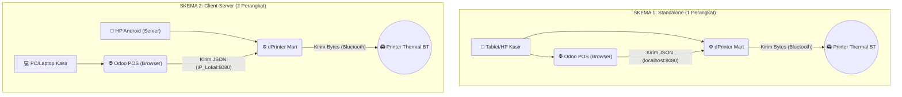

# 🖨️ dPrinter Mart

**Versi 1.0.0**

Aplikasi Android berbasis **Flutter** yang bertindak sebagai *Local Print Server* (Virtual IoT Box) untuk menjembatani sistem kasir **Odoo 18 Point of Sale (POS)** dengan **Printer Thermal Bluetooth**. Dibuat khusus untuk kebutuhan operasional dRetail Mart.

Sistem ini memungkinkan kasir mencetak struk secara **langsung (Direct Print)** dari *browser* ke printer thermal tanpa memerlukan perangkat keras Odoo IoT Box yang mahal, serta memiliki fungsionalitas tambahan untuk mencetak teks bebas, gambar, dan dokumen PDF secara langsung dari aplikasi.

---

## ✨ Fitur Utama

- 🚀 **Bypass Odoo IoT Box:** Mengubah HP/Tablet Android menjadi pelayan cetak (*Print Server*) mandiri untuk menghubungkan Odoo POS dengan Printer Thermal Bluetooth.
- ⚡ **Auto-Print & Manual Print:** Mendukung cetak otomatis setelah validasi pembayaran, maupun cetak ulang manual dari Odoo POS.
- 📄 **Cetak PDF, Gambar, dan Teks:** Dilengkapi dengan fitur bawaan pada aplikasi untuk mencetak teks bebas (Free Text), Gambar (Image), dan Dokumen PDF langsung ke Printer Thermal.
- 📡 **Smart Error Notification:** Jika aplikasi tertutup atau printer mati, Odoo POS tidak akan *crash/hang*, melainkan memunculkan popup notifikasi *Error* merah.
- 🔄 **Seamless Background Process:** Aplikasi menjalankan HTTP Server di latar belakang (port 8080) yang tetap berjalan meskipun aplikasi di-*minimize*.
- 🧻 **Auto-Scaling Layout:** Menggunakan ESC/POS *byte commands* asli yang secara otomatis menyesuaikan kerapatan karakter printer (Mendukung ukuran kertas 58mm, 80mm, dan 100mm).

---

## 🛠️ Topologi & Skema Penggunaan

Aplikasi ini sangat fleksibel dan mendukung 2 skema operasional:

---

## ⚙️ Teknologi yang Digunakan

- **Flutter** & **Dart** (Framework & Bahasa Pemrograman)
- **print_bluetooth_thermal** (Komunikasi Bluetooth & ESC/POS)
- **shelf** & **shelf_router** (HTTP Local Server)
- **pdfx** & **image** (Render dokumen PDF dan Gambar untuk format cetak printer thermal)
