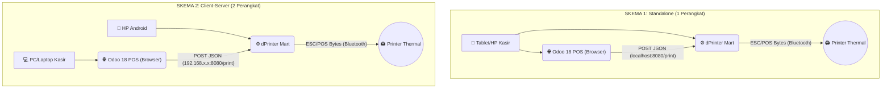

# 🖨️ dPrinter Mart

**Versi 1.0.2** | Package: `id.dprinter.mart` | Dibuat oleh **Sarana Digital Retail**

Aplikasi Android berbasis **Flutter** yang berfungsi sebagai **Local Print Server** — menjembatani sistem kasir **Odoo 18 Point of Sale (POS)** dengan **Printer Thermal Bluetooth**, tanpa memerlukan perangkat keras IoT Box.

Sistem ini bekerja bersama modul Odoo **`sdr_print_direct_pos`** (versi `18.0.1.2.0`) yang terpasang di Odoo 18 POS untuk mengirim perintah cetak langsung ke aplikasi ini melalui HTTP request lokal.

---

## ✨ Fitur Utama

| Fitur | Deskripsi |
|-------|-----------|
| 🚀 **Bypass IoT Box** | Mengubah HP/Tablet Android menjadi print server mandiri |
| 🧾 **Full & Basic Receipt** | Dua mode struk — lengkap (detail item, diskon, pajak) dan ringkas (nama produk & qty saja) |
| 📊 **Session Summary Report** | Cetak laporan ringkasan sesi kasir (Gross Sales, DPP, PPN, Pembayaran, Kas) |
| 💰 **Cash Drawer** | Kontrol laci kasir otomatis sebelum/sesudah cetak |
| 🔄 **Print Queue** | Antrian otomatis untuk job yang gagal, retry saat koneksi kembali |
| ⚡ **Auto-Print** | Cetak otomatis setelah validasi pembayaran di Odoo POS |
| 📝 **Free Text Print** | Cetak teks bebas langsung dari aplikasi (tab Teks) |
| 🖼️ **Image Print** | Cetak gambar dari galeri ke printer thermal (tab Gambar) |
| 📑 **PDF Print** | Render dan cetak dokumen PDF halaman per halaman (tab PDF) |
| 🔄 **HTTP Server Background** | Server berjalan di port `8080`, tetap aktif saat aplikasi di-minimize |
| 🔊 **Error Notification** | Odoo POS menampilkan notifikasi merah jika printer offline — tidak crash |
| 🖥️ **Android Print Service** | Terdaftar sebagai layanan cetak sistem Android |
| ⚙️ **Printer Settings** | Konfigurasi ukuran kertas (58mm/80mm/100mm), chars per baris, auto-cut, extra feed |
| 🌐 **Multi-Bahasa** | Mendukung Bahasa Indonesia dan English |

---

## 🛠️ Topologi & Skema Penggunaan



### Alur Kerja

1. **Odoo POS** (via modul `sdr_print_direct_pos`) mengirim `POST /print` dengan payload JSON ke HTTP Server dPrinter Mart.
2. **dPrinter Mart** mem-parsing JSON, mengkonversinya ke perintah **ESC/POS bytes**, dan mengirimnya ke **Printer Thermal** via Bluetooth.
3. **Status** sukses / error dikembalikan ke Odoo POS secara *realtime* dalam format JSON.

---

## 📂 Struktur Proyek

```
sdr_printer_manager/
├── pubspec.yaml
├── lib/
│   ├── main.dart                       # Entry point aplikasi
│   ├── models/                         # Model data
│   │   ├── printer_device.dart
│   │   └── print_history.dart
│   ├── providers/                      # Riverpod state management
│   │   ├── app_state_provider.dart     # Application state
│   │   ├── logs_provider.dart          # Activity logs
│   │   ├── bluetooth_provider.dart
│   │   ├── server_provider.dart
│   │   ├── history_provider.dart
│   │   └── print_queue_provider.dart   # Print queue state
│   ├── services/                      # Business logic
│   │   ├── bluetooth_service.dart      # Bluetooth connection + retry
│   │   ├── print_server_service.dart   # HTTP Server (port 8080)
│   │   ├── print_queue_service.dart    # Offline queue management
│   │   └── print_history_service.dart
│   ├── screens/
│   │   ├── splash_screen.dart
│   │   ├── main_shell.dart            # Main shell + navigation
│   │   ├── scan_screen.dart
│   │   ├── settings_screen.dart
│   │   ├── printer_settings_screen.dart
│   │   ├── text_tab.dart
│   │   ├── image_tab.dart
│   │   ├── pdf_tab.dart
│   │   ├── log_screen.dart
│   │   └── widgets/                    # Reusable components
│   │       ├── status_card.dart
│   │       ├── printer_card.dart
│   │       ├── stats_row.dart
│   │       ├── port_card.dart
│   │       ├── test_print_card.dart
│   │       ├── log_card.dart
│   │       ├── auto_start_card.dart
│   │       └── home_tab.dart
│   └── utils/
│       ├── escpos_helper.dart          # ESC/POS builder
│       ├── test_print_template.dart
│       ├── strings.dart
│       ├── constants.dart
│       └── colors.dart
├── test/
│   ├── escpos_helper_test.dart        # 43 unit tests
│   └── widget_test.dart
└── android/
    └── app/src/main/kotlin/
        └── SdrPrintService.kt          # Android Print Service
```

---

## 🔗 Modul Odoo: `sdr_print_direct_pos`

Modul Odoo yang bekerja bersama aplikasi ini, terpasang di instance **Odoo 18**.

**Lokasi:** `odoo18-staging/sdr_print_direct_pos/`

| File | Fungsi |
|------|--------|
| `static/src/js/sdr_print_service.js` | Service JS utama — normalisasi data order & pengiriman ke dPrinter Mart |
| `static/src/js/pos_store_print_patch.js` | Patch Odoo POS Store untuk auto-print saat validasi |
| `static/src/css/sdr_print.css` | Styling UI tambahan di layar POS |
| `views/pos_config_views.xml` | Tambahan field konfigurasi di menu Settings POS |

### Konfigurasi di Odoo POS

Buka **Point of Sale > Configuration > Settings**, lalu:

| Field | Nilai |
|-------|-------|
| **SDR Direct Print** | Aktifkan (centang) |
| **Printer URL** | `http://127.0.0.1:8080` (Skema 1) atau `http://192.168.x.x:8080` (Skema 2) |
| **Auto Print on Validate** | Opsional — cetak otomatis saat klik Validate |

---

## 📡 Endpoint HTTP Server

Server berjalan di **port 8080** dan mendukung endpoint berikut:

| Method | Endpoint | Deskripsi |
|--------|----------|-----------|
| `GET` | `/status` | Status server & koneksi Bluetooth printer |
| `GET` | `/test-print?type=test_short` | Cetak struk test pendek |
| `GET` | `/test-print?type=test_long` | Cetak struk test lengkap |
| `POST` | `/print` | Cetak berdasarkan format payload |
| `OPTIONS` | `/print`, `/status` | CORS preflight (untuk browser) |

### Format Payload `POST /print`

**1. Full Receipt (dari Odoo POS):**
```json
{
  "format": "odoo_json",
  "data": {
    "name": "POS/2026/00123",
    "date": "2026-05-15T11:00:00.000Z",
    "cashier": "Kasir 1",
    "receipt_type": "full",
    "company": {
      "name": "dRetail Mart",
      "phone": "021-1234-5678",
      "email": "info@dretail.id",
      "logo": "<base64_string>",
      "currency": { "symbol": "Rp", "decimal_places": 0, "position": "before" }
    },
    "orderlines": [
      {
        "product_name": "Indomie Goreng",
        "qty": 2,
        "price": 3500,
        "price_with_tax": 7000,
        "discount": 0,
        "uom": "Pcs"
      }
    ],
    "paymentlines": [{ "name": "Cash", "amount": 50000 }],
    "total_with_tax": 7000,
    "total_without_tax": 6307,
    "total_tax": 693,
    "total_paid": 50000,
    "change": 43000
  }
}
```

**2. Basic Receipt (struk ringkas):**
```json
{
  "format": "odoo_json",
  "data": {
    "receipt_type": "basic",
    "...": "field lainnya sama seperti Full Receipt"
  }
}
```

**3. Session Summary Report:**
```json
{
  "format": "session_summary",
  "data": {
    "session_name": "POS/2026/0012",
    "pos_name": "Kasir Utama",
    "cashier_name": "Kasir 1",
    "start_at": "2026-05-15 08:00",
    "stop_at": "2026-05-15 17:00",
    "gross_sales": 1500000,
    "total_discount": 50000,
    "total_taxes": 132450,
    "total_sales": 1650000,
    "payments": [
      { "method": "CASH", "amount": 1000000 },
      { "method": "QRIS", "amount": 650000 }
    ],
    "starting_cash": 500000,
    "expected_cash": 1500000
  }
}
```

**4. Teks Bebas:**
```json
{
  "format": "text",
  "data": "Baris 1\nBaris 2\nBaris 3"
}
```

### Contoh Response

```json
{ "status": "ok", "message": "Print berhasil" }
```
```json
{ "status": "error", "message": "Printer tidak terhubung" }
```

---

## ⚙️ Teknologi yang Digunakan

| Teknologi | Versi | Fungsi |
|-----------|-------|--------|
| **Flutter & Dart** | SDK ^3.5.0 | Framework & bahasa pemrograman |
| **flutter_riverpod** | ^3.3.1 | State management |
| **print_bluetooth_thermal** | Local | Komunikasi Bluetooth & protokol ESC/POS |
| **shelf & shelf_router** | ^1.4.1 / ^1.1.4 | HTTP Local Server (port 8080) |
| **pdfx** | ^2.6.0 | Render dokumen PDF untuk cetak thermal |
| **image** | ^4.2.0 | Pemrosesan gambar & dithering untuk thermal |
| **permission_handler** | ^11.3.1 | Manajemen izin Bluetooth & lokasi |
| **network_info_plus** | ^6.0.1 | Deteksi IP lokal untuk mode client-server |
| **file_picker** | ^8.0.0 | Pemilihan file PDF & gambar |
| **shared_preferences** | ^2.3.2 | Penyimpanan pengaturan lokal |
| **curved_navigation_bar** | ^1.0.6 | Navigasi tab bawah |

---

## 📋 Izin Android yang Dibutuhkan

| Izin | Alasan |
|------|--------|
| `BLUETOOTH` & `BLUETOOTH_ADMIN` | Scan & koneksi ke printer thermal |
| `BLUETOOTH_CONNECT` & `BLUETOOTH_SCAN` | Akses Bluetooth pada Android 12+ |
| `ACCESS_FINE_LOCATION` | Wajib untuk scanning Bluetooth di Android |
| `INTERNET` & `ACCESS_NETWORK_STATE` | HTTP Server & komunikasi dengan Odoo POS |
| `ACCESS_WIFI_STATE` | Deteksi IP lokal perangkat |

---

## 📦 Informasi Aplikasi

| Informasi | Nilai |
|-----------|-------|
| **Nama Aplikasi** | dPrinter Mart |
| **Package ID** | `id.dprinter.mart` |
| **Versi** | 1.0.2 |
| **Version Code** | 13 |
| **Min SDK** | Android 5.0+ (SDK 21) |
| **Target SDK** | 36 |
| **Orientasi** | Portrait Only |
| **Port HTTP Server** | 8080 |
| **Ukuran Kertas** | 58mm / 80mm / 100mm |

---

## 🚀 Cara Build & Instalasi

### Prasyarat

- Flutter SDK `^3.5.0`
- Android Studio / VS Code
- Perangkat Android dengan USB Debugging aktif

### Build

```bash
# Install dependencies
flutter pub get

# Run di perangkat (mode debug)
flutter run

# Build APK release
flutter build apk --release
```

APK hasil build ada di:
```
build/app/outputs/flutter-apk/app-release.apk
```

---

## 📖 Panduan Penggunaan Singkat

### 1. Koneksi Printer Bluetooth

1. Buka **dPrinter Mart**, pastikan Bluetooth dan Lokasi aktif.
2. Di **Dashboard**, ketuk **"Pilih"** pada kartu printer.
3. Pilih printer thermal dari daftar hasil scan.
4. Tunggu hingga status berubah menjadi **"Terhubung via Bluetooth"**.

### 2. Aktifkan Print Server

1. Ketuk tombol **"Aktifkan Printer"** di Dashboard.
2. Jika berhasil, status berubah menjadi **"Printer Aktif"** (hijau).
3. Catat **URL Server** yang ditampilkan (contoh: `http://192.168.1.100:8080`).

### 3. Konfigurasi Odoo POS

1. Buka **POS > Configuration > Settings**.
2. Aktifkan **SDR Direct Print** dan masukkan URL server.
3. Simpan dan buka sesi POS.

### 4. Test Print

Dari browser di perangkat yang terhubung ke server:

```
GET http://192.168.1.100:8080/test-print?type=test_short
GET http://192.168.1.100:8080/test-print?type=test_long
```

Atau langsung dari aplikasi: **Pengaturan Printer > Cetak Percobaan (Pendek / Lengkap)**.

---

## 📝 Catatan Penting

- Port default adalah **8080**. Pastikan port ini tidak digunakan aplikasi lain.
- Aplikasi mendukung printer **58mm**, **80mm**, dan **100mm** — sesuaikan di menu **Pengaturan Printer**.
- Format tanggal pada struk: **DD/MM/YYYY HH:mm** (waktu lokal perangkat).
- Data currency (simbol, desimal, posisi) diambil langsung dari konfigurasi Odoo, bukan hardcoded.
- Log aktivitas realtime tersedia di Dashboard dan layar **Riwayat Log**.

---

## 📜 Lisensi

Proyek ini dilisensikan di bawah **MIT License** — lihat file [LICENSE](LICENSE) untuk detailnya.

&copy; 2026 Sarana Digital Retail — dRetail Mart
