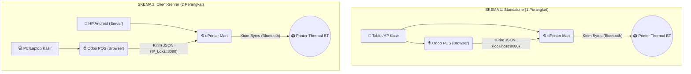

# 🖨️ dPrinter Mart

**Versi 1.0.0.1** | Package: `id.dprinter.mart`

Aplikasi Android berbasis **Flutter** yang bertindak sebagai *Local Print Server* (Virtual IoT Box) untuk menjembatani sistem kasir **Odoo 18 Point of Sale (POS)** dengan **Printer Thermal Bluetooth**. Dibuat khusus untuk kebutuhan operasional dRetail Mart.

Sistem ini memungkinkan kasir mencetak struk secara **langsung (Direct Print)** dari *browser* ke printer thermal tanpa memerlukan perangkat keras Odoo IoT Box yang mahal, serta memiliki fungsionalitas tambahan untuk mencetak teks bebas, gambar, dan dokumen PDF secara langsung dari aplikasi.

---

## ✨ Fitur Utama

- 🚀 **Bypass Odoo IoT Box** — Mengubah HP/Tablet Android menjadi pelayan cetak (*Print Server*) mandiri untuk menghubungkan Odoo POS dengan Printer Thermal Bluetooth.
- ⚡ **Auto-Print & Manual Print** — Mendukung cetak otomatis setelah validasi pembayaran, maupun cetak ulang manual dari Odoo POS.
- 📄 **Cetak PDF, Gambar, dan Teks** — Dilengkapi dengan fitur bawaan untuk mencetak teks bebas (*Free Text*), Gambar (*Image*), dan Dokumen PDF langsung ke Printer Thermal.
- 🔊 **Smart Error Notification** — Jika printer mati atau terputus, Odoo POS menampilkan popup notifikasi *Error* merah tanpa *crash/hang*.
- 🖥️ **Print Service Terintegrasi** — Aplikasi terdaftar sebagai *Android Print Service*, memungkinkan mencetak dari aplikasi lain melalui sistem print Android.
- 🔄 **Seamless Background Process** — Aplikasi menjalankan HTTP Server di latar belakang (port 8080) yang tetap berjalan meskipun aplikasi di-*minimize*.
- 📱 **Portrait Only** — Aplikasi dikunci dalam mode portrait untuk pengalaman kasir yang konsisten.
- 🧻 **Auto-Scaling ESC/POS** — Menggunakan perintah *byte commands* asli yang secara otomatis menyesuaikan kerapatan karakter printer (Mendukung ukuran kertas 58mm, 80mm, dan 100mm).

---

## 🛠️ Topologi & Skema Penggunaan

Aplikasi ini sangat fleksibel dan mendukung 2 skema operasional:



### Alur Kerja:
1. **Odoo POS** mengirim perintah cetak (JSON) ke HTTP Server aplikasi via `localhost:8080` (standalone) atau `192.168.x.x:8080` (client-server).
2. **dPrinter Mart** menerima JSON, mengkonversi ke perintah ESC/POS, lalu mengirim ke **Printer Thermal** melalui Bluetooth.
3. Hasil cetak (**Sukses / Error**) dikembalikan ke **Odoo POS** secara *realtime*.

---

## 📂 Struktur Proyek

```
lib/
├── main.dart                  # Entry point aplikasi
├── models/                    # Model data
├── screens/                   # Halaman/Layar aplikasi
│   ├── home_screen.dart       # Layar utama (dashboard printer)
│   ├── scan_screen.dart      # Scan & pairing perangkat Bluetooth
│   ├── printer_settings_screen.dart  # Pengaturan printer
│   ├── settings_screen.dart  # Pengaturan aplikasi
│   ├── log_screen.dart       # Log aktivitas cetak
│   ├── splash_screen.dart    # Layar pembuka
│   ├── main_shell.dart       # Shell navigasi bawah
│   ├── text_tab.dart         # Tab cetak teks bebas
│   ├── image_tab.dart        # Tab cetak gambar
│   └── pdf_tab.dart          # Tab cetak dokumen PDF
└── services/
    ├── bluetooth_service.dart   # Manajemen koneksi Bluetooth
    └── print_server_service.dart  # HTTP Server (port 8080)
```

---

## ⚙️ Teknologi yang Digunakan

| Teknologi | Fungsi |
|-----------|--------|
| **Flutter & Dart** | Framework & bahasa pemrograman |
| **print_bluetooth_thermal** | Komunikasi Bluetooth & protokol ESC/POS |
| **shelf & shelf_router** | HTTP Local Server (port 8080) |
| **pdfx & image** | Render dokumen PDF & gambar untuk cetak thermal |
| **permission_handler** | Manajemen izin Bluetooth & lokasi |
| **network_info_plus** | Deteksi IP lokal untuk mode client-server |
| **file_picker** | Pemilihan file PDF & gambar |
| **shared_preferences** | Penyimpanan pengaturan |
| **curved_navigation_bar** | Navigasi tab bawah |

---

## 📋 Izin yang Dibutuhkan

| Izin | Alasan |
|------|--------|
| `BLUETOOTH` & `BLUETOOTH_ADMIN` | Scan & koneksi ke printer thermal |
| `BLUETOOTH_CONNECT` & `BLUETOOTH_SCAN` | Akses Bluetooth pada Android 12+ |
| `ACCESS_FINE_LOCATION` | Wajib untuk scanning Bluetooth di Android |
| `INTERNET` & `ACCESS_NETWORK_STATE` | Komunikasi HTTP dengan Odoo POS |
| `ACCESS_WIFI_STATE` | Deteksi IP lokal perangkat |

---

## 📦 Informasi Aplikasi

| Informasi | Nilai |
|-----------|-------|
| **Nama Aplikasi** | dPrinter Mart |
| **Package ID** | `id.dprinter.mart` |
| **Versi** | 1.0.0.1 |
| **Versi Code** | 12 |
| **Min SDK** | Flutter default |
| **Target SDK** | 36 |
| **Orientasi** | Portrait Only |

---

## 🚀 Cara Instalasi

1. **Clone repository** (atau salin folder proyek ke lokal Anda).
2. **Buka terminal** di folder proyek, lalu jalankan:
   ```bash
   flutter pub get
   ```
3. **Buka proyek** di Android Studio / VS Code, lalu:
   - Hubungkan perangkat Android (USB Debugging aktif).
   - Jalankan:
     ```bash
     flutter run
     ```
   - Atau untuk build APK Release:
     ```bash
     flutter build apk --release
     ```
4. **APK siap** di `build/app/outputs/flutter-apk/app-release.apk`.

---

## 📡 Endpoint HTTP Server

| Method | Endpoint | Deskripsi |
|--------|----------|-----------|
| `POST` | `/print` | Mencetak JSON perintah ESC/POS |
| `GET`  | `/status` | Status koneksi printer |
| `GET`  | `/logs`   | Log aktivitas cetak |

---

## 📖 Panduan Penggunaan

### 1. Persiapan Awal

Sebelum menggunakan aplikasi, pastikan:

- **Bluetooth** dan **Lokasi** diaktifkan di perangkat Android.
- **Printer Thermal** sudah menyala dan dalam mode pairing (LED indikator berkedip).
- Untuk **Skema 2 (Client-Server)**, pastikan perangkat Android dan PC/Laptop terhubung ke **jaringan yang sama** (WiFi yang sama).

---

### 2. Koneksi Printer Bluetooth

Ikuti langkah berikut di aplikasi:

1. Buka aplikasi **dPrinter Mart**.
2. Di layar **Dashboard**, ketuk tombol **"Pilih"** pada kartu printer.
3. Aplikasi akan membuka layar **Scan Bluetooth** dan mulai memindai perangkat terdekat.
4. Pilih printer thermal yang ingin digunakan dari daftar.
5. Tunggu hingga koneksi berhasil — indikator **"Terhubung via Bluetooth"** akan muncul.

> **Tips:** Printer yang sudah pernah terhubung akan tersimpan otomatis dan dapat digunakan kembali tanpa scan ulang.

---

### 3. Mengaktifkan Print Server

Setelah printer terhubung:

1. Di layar **Dashboard**, ketuk tombol **"Aktifkan Printer"**.
2. Tunggu hingga proses koneksi Bluetooth dan start server selesai.
3. Jika berhasil, layar akan menampilkan:
   - Status: **"Printer Aktif"** (dengan indikator hijau berkedip)
   - **URL Server**: `http://192.168.x.x:8080`
4. Ketuk **"Salin URL"** untuk menyalin tautan server ke clipboard.

> **Auto-Start:** Aktifkan toggle **"Aktifkan Otomatis"** agar printer langsung aktif setiap kali aplikasi dibuka (asalkan printer sudah terhubung sebelumnya).

---

### 4. Mengubah Port Server (Opsional)

Jika port 8080 bentrok dengan aplikasi lain:

1. Ketuk kartu **"Port Server"** di layar Dashboard.
2. Masukkan nomor port baru (1024–65535).
3. Ketuk **"Simpan"**.
4. Server akan restart secara otomatis pada port baru.

---

### 5. Integrasi dengan Odoo POS

#### Konfigurasi Odoo (Skema 1 - Standalone)

Jika Odoo POS berjalan di **perangkat yang sama** dengan dPrinter Mart:

```python
# Di Odoo POS, set proxy_url ke localhost
# Buka: Pengaturan POS > Hardware Proxy
# Isikan: http://localhost:8080
```

#### Konfigurasi Odoo (Skema 2 - Client-Server)

Jika Odoo POS berjalan di **PC/Laptop terpisah**:

1. Pastikan perangkat Android dan PC/Laptop terhubung ke **WiFi yang sama**.
2. Di aplikasi dPrinter Mart, aktifkan printer dan catat **URL Server** (contoh: `http://192.168.1.100:8080`).
3. Di Odoo POS (PC):
   ```
   # Set proxy_url ke IP perangkat Android
   # Contoh: http://192.168.1.100:8080
   ```

#### Format Request ke `/print`

Odoo POS secara otomatis mengirim perintah cetak dalam format JSON ke endpoint `POST /print`. Berikut contoh format yang didukung:

**Format Odoo JSON:**
```json
{
  "format": "odoo_json",
  "receipt_type": "full",
  "data": {
    "order": {
      "name": "00123",
      "date": "2025-01-14 10:30:00",
      "cashier": "Kasir 1",
      "total": 150000,
      "payment": "Tunai"
    },
    "lines": [
      {"name": "Kopi Hitam", "qty": 2, "price": 15000},
      {"name": "Roti Isi", "qty": 1, "price": 12000}
    ]
  }
}
```

**Format Session Summary:**
```json
{
  "format": "session_summary",
  "data": {
    "session_name": "Shift Pagi",
    "date": "2025-01-14",
    "total_sales": 1500000,
    "total_orders": 45,
    "cash": 1000000,
    "card": 500000
  }
}
```

**Format Text Biasa:**
```json
{
  "format": "text",
  "data": "Baris 1\nBaris 2\nBaris 3"
}
```

---

### 6. Test Print

Untuk memastikan printer berfungsi:

1. Buka browser di perangkat yang terhubung ke server.
2. Kunjungi:
   ```
   http://192.168.1.100:8080/test-print
   ```
3. Printer akan mencetak struk test pendek.
4. Untuk test panjang, kunjungi:
   ```
   http://192.168.1.100:8080/test-print?type=test_long
   ```

---

### 7. Cetak Manual (Tanpa Odoo POS)

Aplikasi mendukung cetak langsung tanpa Odoo POS melalui tab navigasi bawah:

#### 📝 Teks Bebas (Tab Teks)
1. Pilih tab **"Teks"** di navigasi bawah.
2. Ketik teks yang ingin dicetak.
3. Ketuk tombol **"Cetak"**.
4. Printer akan mencetak teks sesuai format ESC/POS.

#### 🖼️ Gambar (Tab Gambar)
1. Pilih tab **"Gambar"** di navigasi bawah.
2. Ketuk tombol **"Pilih Gambar"**.
3. Pilih gambar dari galeri perangkat.
4. Gambar akan di-*render* ke format printer thermal.
5. Ketuk **"Cetak"**.

#### 📑 Dokumen PDF (Tab PDF)
1. Pilih tab **"PDF"** di navigasi bawah.
2. Ketuk tombol **"Pilih File PDF"**.
3. Pilih file PDF dari penyimpanan perangkat.
4. PDF akan di-*render* per halaman.
5. Ketuk **"Cetak"** untuk mencetak halaman yang dipilih.

---

### 8. Memantau Aktivitas

Layar **Dashboard** menampilkan log aktivitas *realtime*:

- Request print dari Odoo POS
- Status koneksi Bluetooth
- Error atau kegagalan cetak
- Counter struk yang berhasil dicetak

Ketuk ikon **"Riwayat"** (⏱️) di sudut kanan atas untuk melihat log lengkap.

---

## 📝 Catatan Penting

- Pastikan **Bluetooth** dan **Lokasi** diaktifkan di perangkat Android sebelum menggunakan aplikasi.
- Port HTTP Server default: **8080**. Pastikan port tersebut tidak digunakan oleh aplikasi lain.
- Aplikasi mendukung printer dengan lebar kertas **58mm**, **80mm**, dan **100mm** secara otomatis.

---

## 📜 Lisensi